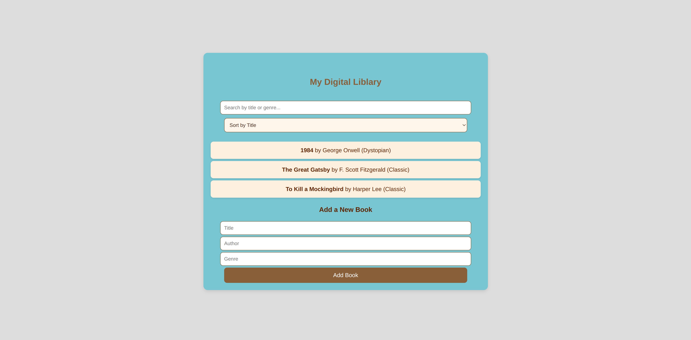

📚 Digital Library App
A simple React-based Digital Library that allows users to:

View a list of books.
Search for books by title or genre.
Sort books by title or author.
Add new books to the collection.
🚀 Features
✅ Display books with titles, authors, and genres.
✅ Search books dynamically by title or genre.
✅ Sort books alphabetically by title or author.
✅ Add books using an easy-to-use form.
✅ Responsive & Modern UI with a brown-themed design.

🛠️ Tech Stack
React.js (Functional Components & Hooks)
CSS (Custom Styling with a brown/blue-themed UI)
JavaScript (ES6+)

📸 Screenshots

📑 Adding a New Book

📁 Folder Structure
bash
Copy
Edit
📂 digital-library
│── 📄 package.json        # Dependencies & Scripts
│── 📄 README.md           # Documentation (You are here)
│── 📄 App.js              # Main Component
│── 📄 App.css             # Styling (Brown Theme)
│── 📂 src                 # React Code
│   ├── 📄 index.js        # Entry File
│   ├── 📄 App.js          # Main UI & Logic
│   ├── 📄 App.css         # Custom Styles
└── ...
💡 How to Use
Search Books
🔍 Type in the search bar to filter books by title or genre.

Sort Books
🔄 Select Sort by Title or Sort by Author from the dropdown.

Add New Books
➕ Enter the title, author, and genre and click "Add Book".

🤝 Contributing
Contributions are welcome!

Fork the repo
Create a new branch (feature-new-idea)
Commit your changes
Push & Create a PR
📜 License
This project is MIT Licensed. Feel free to use and modify it.